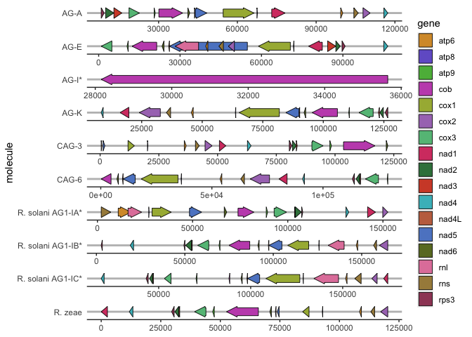
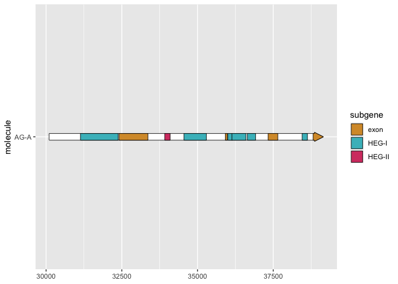

## Testing gggenes for graphing mtDNA genes

First we need to load the library:


```r
library(ggplot2)
library(gggenes)
library(crayon)
```

```
## 
## Attaching package: 'crayon'
```

```
## The following object is masked from 'package:ggplot2':
## 
##     %+%
```

```r
library(patchwork)
```


Setting up the palette and reading input files:


```r
palette<-c("#d79935", "#7361cd", "#5bb748", "#c454ba", "#a7b542", "#a978be", "#64be86", "#d54271", "#39804b", "#d24d33", "#46bcc5", "#c3704f", "#5e87cb", "#69792c", "#e183a9", "#a78b4a", "#9e4765")

GeneMap <- read.csv("GeneMap.txt", sep = "\t")
CobMap_introns <- read.csv("CobMap_introns.txt", sep = "\t")
```

# whole mitogenome plot


```r
ggplot(GeneMap, aes(xmin = start, xmax = end, y = molecule, fill = gene, 
                forward = orientation)) +
  geom_gene_arrow() +
  facet_wrap(~ molecule, scales = "free", ncol = 1) +
  scale_fill_manual(values = palette) +
  theme_genes()
```

<!-- -->

# cob plot


```r
palette2<-c("#d79935", "#46bcc5", "#d54271")
#AG-A
(AGA <- ggplot(subset(GeneMap, molecule == "AG-A" & gene == "cob"),
       aes(xmin = start, xmax = end, y = molecule)) +
  geom_gene_arrow() +
  geom_subgene_arrow(data = subset(CobMap_introns, molecule == "AG-A" & gene == "cob"),
    aes(xsubmin = from, xsubmax = to, fill = subgene) ) + scale_fill_manual(values = palette2)
)
```

<!-- -->

#AG-E
AGE <- ggplot(subset(GeneMap, molecule == "AG-E" & gene == "cob"),
                aes(xmin = start, xmax = end, y = molecule)) +
  geom_gene_arrow() +
  geom_subgene_arrow(data = subset(CobMap_introns, molecule == "AG-E" & gene == "cob"),
                     aes(xsubmin = from, xsubmax = to, fill = subgene) ) + scale_fill_manual(values = palette2)
#AG-K
AGK <- ggplot(subset(GeneMap, molecule == "AG-K" & gene == "cob"),
                        aes(xmin = start, xmax = end, y = molecule)) +
  geom_gene_arrow() +
  geom_subgene_arrow(data = subset(CobMap_introns, molecule == "AG-K" & gene == "cob"),
                     aes(xsubmin = from, xsubmax = to, fill = subgene) ) + scale_fill_manual(values = palette2)
#CAG-3
CAG3 <- ggplot(subset(GeneMap, molecule == "CAG-3" & gene == "cob"),
                         aes(xmin = start, xmax = end, y = molecule)) +
  geom_gene_arrow() +
  geom_subgene_arrow(data = subset(CobMap_introns, molecule == "CAG-3" & gene == "cob"),
                     aes(xsubmin = from, xsubmax = to, fill = subgene) ) + scale_fill_manual(values = palette2)
#CAG-6
CAG6 <- ggplot(subset(GeneMap, molecule == "CAG-6" & gene == "cob"),
                aes(xmin = start, xmax = end, y = molecule)) +
  geom_gene_arrow() +
  geom_subgene_arrow(data = subset(CobMap_introns, molecule == "CAG-6" & gene == "cob"),
                     aes(xsubmin = from, xsubmax = to, fill = subgene) )+ scale_fill_manual(values = palette2)
#R. zeae
Rzeae <- ggplot(subset(GeneMap, molecule == "R. zeae" & gene == "cob"),
                aes(xmin = start, xmax = end, y = molecule)) +
  geom_gene_arrow() +
  geom_subgene_arrow(data = subset(CobMap_introns, molecule == "R. zeae" & gene == "cob"),
                     aes(xsubmin = from, xsubmax = to, fill = subgene) )+ scale_fill_manual(values = palette2)
#AG-I referencia
AGI <- ggplot(subset(GeneMap, molecule == "AG-I*" & gene == "cob"),
                   aes(xmin = start, xmax = end, y = molecule)) +
  geom_gene_arrow() +
  geom_subgene_arrow(data = subset(CobMap_introns, molecule == "AG-I*" & gene == "cob"),
                     aes(xsubmin = from, xsubmax = to, fill = subgene) )+ scale_fill_manual(values = palette2)
#AG1-IA referencia
AG1IA <- ggplot(subset(GeneMap, molecule == "R. solani AG1-IA*" & gene == "cob"),
                aes(xmin = start, xmax = end, y = molecule)) +
  geom_gene_arrow() +
  geom_subgene_arrow(data = subset(CobMap_introns, molecule == "R. solani AG1-IA*" & gene == "cob"),
                     aes(xsubmin = from, xsubmax = to, fill = subgene) )+ scale_fill_manual(values = palette2)
#AG1-IB referencia
AG1IB <- ggplot(subset(GeneMap, molecule == "R. solani AG1-IB*" & gene == "cob"),
                aes(xmin = start, xmax = end, y = molecule)) +
  geom_gene_arrow() +
  geom_subgene_arrow(data = subset(CobMap_introns, molecule == "R. solani AG1-IB*" & gene == "cob"),
                     aes(xsubmin = from, xsubmax = to, fill = subgene) )+ scale_fill_manual(values = palette2)
#AG1-IC referencia
AG1IC <- ggplot(subset(GeneMap, molecule == "R. solani AG1-IC*" & gene == "cob"),
                aes(xmin = start, xmax = end, y = molecule)) +
  geom_gene_arrow() +
  geom_subgene_arrow(data = subset(CobMap_introns, molecule == "R. solani AG1-IC*" & gene == "cob"),
                     aes(xsubmin = from, xsubmax = to, fill = subgene) )+ scale_fill_manual(values = palette2)
#Pegar gráficas
(AGA/AGE/AGK/CAG3/CAG6/AGI)|(Rzeae/AG1IA/AG1IB)


